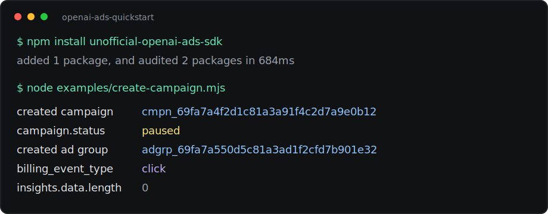

# Unofficial OpenAI Ads SDK

**Unofficial, not affiliated with OpenAI.** Created and maintained by Ilya Baklanov.

TypeScript and Python SDKs for advertisers using the OpenAI Ads Advertiser API. Handwritten clients, typed models, pagination, retries, uploads, insights, and CPM/CPC lifecycle coverage.

Official API docs: [developers.openai.com/ads/api-overview](https://developers.openai.com/ads/api-overview)

```sh
npm install unofficial-openai-ads-sdk
pip install unofficial-openai-ads-sdk
```

```ts
import { OpenAIAds } from "unofficial-openai-ads-sdk";
const ads = new OpenAIAds({ apiKey: process.env.OPENAI_ADS_API_KEY });
const campaign = await ads.campaigns.create({
  name: "Spring launch",
  status: "paused",
  budget: { lifetime_spend_limit_micros: 100_000_000 },
  targeting: { locations: { countries: ["US"] } },
  bidding_type: "clicks",
});
console.log(campaign.id);
```



| What it does | What it does not do |
| --- | --- |
| Campaigns, ad groups, ads, uploads, ad account, and insights. | It is not an official OpenAI package or endorsed integration. |
| Typed TypeScript and Python clients with strict request validation. | It does not run in browsers with advertiser API keys. |
| Pagination, timeouts, typed errors, request IDs, and retry handling. | It does not manage pixels, Conversions API, billing, or creative policy review. |
| CPM and CPC creation paths. | It does not guarantee recently changed API behavior will stay stable. |

## Python Quickstart

```py
import os
from openai_ads import OpenAIAds

client = OpenAIAds(api_key=os.environ["OPENAI_ADS_API_KEY"])

campaign = client.campaigns.create(
    name="Spring launch",
    status="paused",
    budget={"lifetime_spend_limit_micros": 100_000_000},
    targeting={"locations": {"countries": ["US"]}},
    bidding_type="clicks",
)

print(campaign.id)
```

## Package Names

- TypeScript: `unofficial-openai-ads-sdk`
- Python: `unofficial-openai-ads-sdk`, imported as `openai_ads`

## Supported API Surface

- Campaigns
- Ad groups
- Ads
- Uploads
- Ad account
- Insights

The SDK models the current public OpenAI Ads API and supports CPC creation with `billing_event_type = "click"` for CPC ad groups and `bidding_type = "clicks"` for net-new CPC campaigns. It uploads creative images through `/upload` and uses returned `file_id` values as durable handles.

## Reliability

- Retries `408`, `409`, `429`, and `5xx` with exponential backoff and jitter.
- Honors `Retry-After`.
- Does not retry mutating requests by default unless an idempotency key or explicit retry option is provided.
- Parses unknown response fields without failing, while keeping request validation strict.

## Development

```sh
npm install
npm run build
npm run test

uv sync --all-extras --dev
uv run pytest
uv run ruff check .
uv run pyright
```

Live API integration tests are opt-in:

```sh
OPENAI_ADS_API_KEY=... npm run test -w packages/typescript -- test/live-api.test.ts
OPENAI_ADS_API_KEY=... uv run pytest python/tests/test_live_api.py
```

Mutating live tests must also set `OPENAI_ADS_LIVE_MUTATE=1`.
